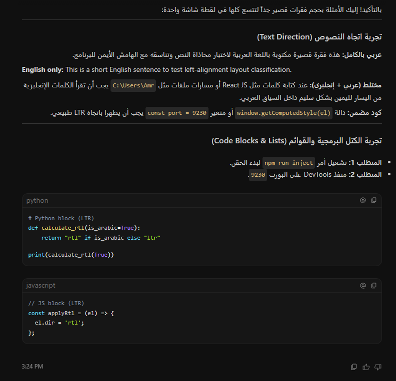

# Antigravity RTL Toolkit

Local Right-to-Left (RTL) rendering fixes for Arabic/English mixed text in the Google Antigravity Desktop application.



---

## ⚡ Quick Start

1. **Download** the latest release ZIP from the [Releases](https://github.com/pawnsmaster/antigravity-rtl-toolkit/releases) page.
2. **Extract** the ZIP archive to a folder on your computer.
3. Save any unsaved work in Antigravity.
4. **Double-click** the launcher file:
   ```cmd
   Run-AntigravityRTL.cmd
   ```
5. The launcher will automatically close any active processes, open a new session with remote debugging enabled on port `9230`, and inject the RTL styling layout fix.
6. You can safely close the console window once the injection is complete (shows `Done`).

---

## ✨ Features

- **Arabic Paragraph Alignment**: Automatically aligns Arabic text paragraphs to the right.
- **Bi-directional Support**: Renders mixed Arabic and English sentences in their natural order.
- **Latin Run Isolation**: English words, punctuation, and paths keep their natural position inside RTL text blocks.
- **RTL Chat Inputs**: Sets `dir="auto"` on the composer box so it dynamically aligns right when you type in Arabic, and left when you type in English—completely lag-free!
- **Strict LTR for Code**: Code blocks (`pre`/`code`), keyboard tags (`kbd`), inline code, terminals, and inputs remain left-aligned and LTR.
- **Port Conflict Resolution**: Runs on port `9230` to avoid conflicts with other Chromium-based launchers (like Codex Desktop).
- **Independent Spawning**: Launches the application decoupled from the parent terminal window, allowing you to safely close the CMD console without shutting down Antigravity.

---

## 🛠️ Technical Architecture

- `src/injected.js`: Evaluated inside the renderer window. Sets up a `MutationObserver` to watch DOM updates, classify Arabic-heavy blocks, and dynamically apply direction tags. Includes specific exclusions for Tailwind arbitrary utility classes.
- `src/rtl-style.css`: Contains custom CSS variables and absolute alignment overrides for RTL elements.
- `desktop/Launch-AntigravityRTL.ps1`: Decoupled process launcher utilizing WMI (`Win32_Process.Create`) to launch the application.
- `desktop/Run-AntigravityRTL.ps1`: Main coordinator that handles NPM installs, process termination logic, and triggering the injector.
- `desktop/inject.mjs`: Polling script that connects via WebSocket to the Chromium DevTools port and injects script resources.

## 📋 Requirements

- Windows 10/11
- Node.js 20+
- Google Antigravity Desktop App

## 📄 License

MIT
